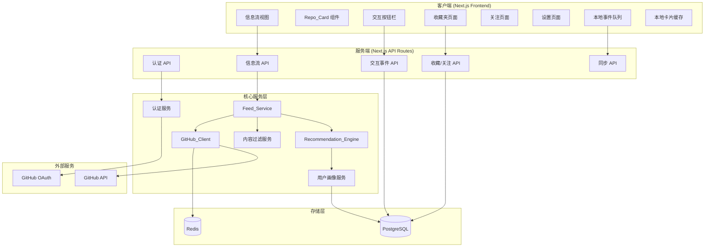
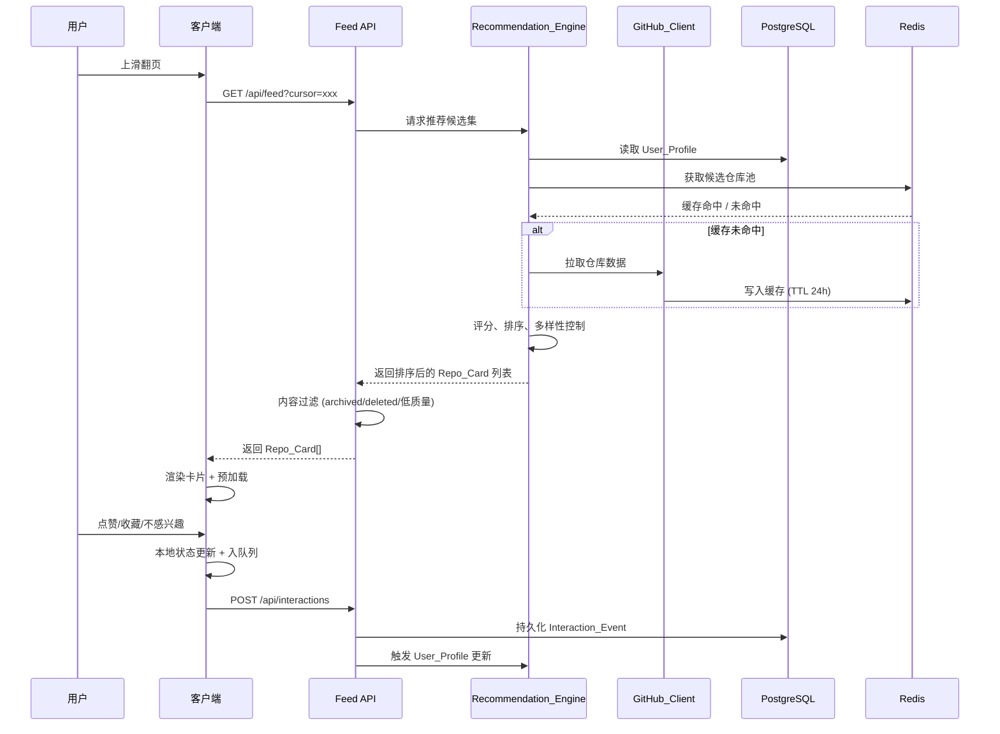

# 设计文档

## 概述

GitTok 是一款"抖音化"的 GitHub 仓库浏览应用，采用全屏垂直滑动卡片信息流的交互模式，让用户以轻松的方式发现和收藏 GitHub 仓库。系统通过基于内容的推荐引擎，根据用户的交互历史（点赞、收藏、关注、不感兴趣等）持续优化推荐精准度。

### 技术选型

| 层级 | 技术 | 理由 |
|------|------|------|
| 前端框架 | Next.js 14 (App Router) + React 18 | SSR/SSG 支持、API Routes 内置后端能力、生态成熟 |
| UI 库 | Tailwind CSS + Framer Motion | 快速样式开发、流畅的滑动动画 |
| 状态管理 | Zustand | 轻量、TypeScript 友好、适合中等复杂度状态 |
| 后端 API | Next.js API Routes (Route Handlers) | 与前端同仓部署、无需额外后端服务 |
| 数据库 | PostgreSQL (via Prisma ORM) | 关系型数据适合用户画像与交互事件、Prisma 提供类型安全 |
| 缓存 | Redis | 仓库数据缓存、限流计数器、会话存储 |
| 认证 | NextAuth.js (GitHub Provider) | 开箱即用的 GitHub OAuth 集成 |
| 测试 | Vitest + fast-check | 单元测试 + 属性测试 |
| 离线存储 | idb-keyval (IndexedDB) | 轻量异步 KV 存储，用于离线事件队列持久化 |
| 部署 | Vercel | 与 Next.js 深度集成、全球 CDN |

### 设计决策

1. **单仓库全栈架构**：前后端共用 Next.js 项目，减少部署复杂度，API Routes 作为 BFF 层
2. **基于内容的推荐**：不依赖协同过滤（无需大量用户数据），使用仓库特征向量与用户画像的点积计算推荐分数
3. **离线优先设计**：本地队列暂存交互事件，网络恢复后批量同步，保证离线可用性
4. **CSS scroll-snap 滑动**：利用浏览器原生 scroll-snap 实现流畅的全屏卡片切换，配合 Framer Motion 增强动画
5. **DOM 滑动窗口虚拟化**：内存中维持最多 100 张卡片缓存（需求 10.5），但 DOM 树中永远只挂载当前卡片 ± 2 张（共 3-5 张）。其余卡片组件卸载，仅在 Zustand store 中保留数据状态。这确保无论用户浏览多少张卡片，DOM 节点数量恒定，满足 200ms 切换性能指标（需求 10.1）
6. **IndexedDB 离线队列持久化**：LocalEventQueue 底层使用 IndexedDB（通过 `idb-keyval` 轻量库）而非 LocalStorage。原因：LocalStorage 是同步阻塞 API 且有 5MB 限制，频繁读写会在滑动时产生微卡顿（Jank）；IndexedDB 是异步非阻塞的，容量充裕，适合高频事件写入场景
7. **RSC/Client Component 明确边界**：Next.js 14 默认 Server Component。整个 Feed 信息流主体（FeedContainer、RepoCardComponent、InteractionBar）以及 Zustand store 消费者必须标记为 `"use client"` 胖组件；登录页、设置页、收藏夹/关注列表的外层布局可利用 Server Component 预渲染静态结构，内部交互部分再嵌套 Client Component。数据获取策略：Feed 流走 Client-side Fetch（SWR/React Query 模式），设置页和列表页走 Server Action + RSC 预渲染

## 架构

### 系统架构图



### 数据流



## 组件与接口

### 前端组件

#### FeedContainer (`"use client"`)
- 职责：管理信息流的滚动状态、预加载逻辑、DOM 滑动窗口虚拟化
- 虚拟化策略：维护 `currentIndex` 指针，DOM 中仅渲染 `[currentIndex - 1, currentIndex, currentIndex + 1]` 三张卡片（边界时为 2 张）。其余卡片数据保留在 Zustand store 的 `cards[]` 数组中，组件不挂载。切换时通过 CSS `transform: translateY()` + Framer Motion 实现 200ms 内的流畅过渡
- 接口：
  - `fetchNextBatch(cursor: string): Promise<RepoCard[]>` — 获取下一批卡片
  - `onCardVisible(cardId: string, timestamp: number): void` — 卡片进入视口回调
  - `onCardLeave(cardId: string, dwellTime: number): void` — 卡片离开视口回调
  - `getVisibleRange(): [number, number]` — 返回当前 DOM 中挂载的卡片索引范围

#### RepoCardComponent (`"use client"`)
- 职责：渲染单张仓库卡片的全部信息
- Props：`RepoCard` 数据 + 用户交互状态
- 展示：仓库名、作者、语言、Star/Fork 数、topics、描述、README 摘要、推荐理由

#### InteractionBar (`"use client"`)
- 职责：渲染交互按钮（点赞、收藏、关注、不感兴趣、打开 GitHub）
- 事件：每个按钮触发对应的 Interaction_Event 记录

#### LocalEventQueue (`"use client"` — IndexedDB 持久化)
- 职责：离线时暂存交互事件至 IndexedDB（通过 `idb-keyval`），网络恢复后按时间戳升序批量同步
- 持久化介质：IndexedDB（异步非阻塞，无容量瓶颈）
- 页面刷新安全：事件写入 IndexedDB 后即持久化，不受组件卸载或页面刷新影响
- 接口：
  - `enqueue(event: InteractionEvent): Promise<void>` — 异步写入 IndexedDB
  - `flush(): Promise<SyncResult>` — 按时间戳升序读取并批量同步
  - `getPending(): Promise<InteractionEvent[]>` — 读取待同步事件

### 后端 API 接口

#### RSC / Client Component 边界划分

| 组件/页面 | 类型 | 理由 |
|-----------|------|------|
| `app/layout.tsx` | Server Component | 静态 shell、metadata、字体加载 |
| `app/page.tsx` (Feed 主页) | Server Component (薄壳) | 仅提供布局容器，内部嵌套 Client Component |
| `FeedContainer` | `"use client"` | 滑动手势、IntersectionObserver、Zustand 消费 |
| `RepoCardComponent` | `"use client"` | 动画、交互状态绑定 |
| `InteractionBar` | `"use client"` | 按钮事件、乐观更新 |
| `app/login/page.tsx` | Server Component | 静态登录页，OAuth 按钮可为 Client Island |
| `app/settings/page.tsx` | Server Component + Client Islands | 表单交互部分为 Client，外层 RSC 预渲染 |
| `app/favorites/page.tsx` | Server Component (数据预取) | 通过 RSC 预渲染列表，删除按钮为 Client Island |
| `app/follows/page.tsx` | Server Component (数据预取) | 同上 |
| Zustand stores | `"use client"` only | 浏览器端状态，不可在 Server Component 中使用 |
| `LocalEventQueue` | `"use client"` only | 依赖 IndexedDB 浏览器 API |

**数据获取策略**：
- Feed 信息流：Client-side Fetch（通过 Zustand async action 调用 `/api/feed`），支持无限滚动和实时预加载
- 收藏夹/关注列表：Server Action + RSC 预渲染初始数据，客户端 mutation 后 `revalidatePath()`
- 设置页：Server Action 处理表单提交，RSC 预渲染当前设置值

#### 认证

```typescript
// POST /api/auth/callback/github
// NextAuth.js 自动处理 OAuth 回调

// GET /api/auth/session
// 返回当前会话信息
interface SessionResponse {
  user: { id: string; name: string; avatar: string; githubToken: string } | null;
  expires: string;
}
```

#### 信息流

```typescript
// GET /api/feed?cursor=string&limit=number
interface FeedRequest {
  cursor?: string;  // 分页游标
  limit?: number;   // 默认 10
}

interface FeedResponse {
  cards: RepoCard[];
  nextCursor: string | null;
  hasMore: boolean;
}
```

#### 交互事件

```typescript
// POST /api/interactions
interface CreateInteractionRequest {
  repoId: string;
  type: InteractionType;
  dwellTimeMs?: number;
  metadata?: Record<string, unknown>;
}

// POST /api/interactions/batch
interface BatchSyncRequest {
  events: CreateInteractionRequest[];
}

type InteractionType =
  | 'like' | 'unlike'
  | 'favorite' | 'unfavorite'
  | 'follow' | 'unfollow'
  | 'not_interested'
  | 'view'
  | 'quick_skip'
  | 'open_external';
```

#### 收藏与关注

```typescript
// GET /api/favorites?page=number&limit=number
interface FavoritesResponse {
  items: FavoriteItem[];
  total: number;
  page: number;
}

// DELETE /api/favorites/:repoId
// GET /api/follows?page=number&limit=number
// DELETE /api/follows/:authorId
```

### 核心服务接口

#### GitHub_Client

```typescript
interface IGitHubClient {
  fetchRepository(owner: string, repo: string): Promise<RepoData>;
  fetchTrendingRepos(language?: string, since?: 'daily' | 'weekly'): Promise<RepoData[]>;
  searchRepos(query: string, sort?: string, perPage?: number): Promise<RepoData[]>;
  fetchReadme(owner: string, repo: string): Promise<string | null>;
  getRateLimitStatus(): Promise<RateLimitInfo>;
}

interface RateLimitInfo {
  remaining: number;
  limit: number;
  resetAt: Date;
}
```

#### Recommendation_Engine

```typescript
interface IRecommendationEngine {
  generateRecommendations(userId: string, count: number): Promise<ScoredRepo[]>;
  updateProfile(userId: string, event: InteractionEvent): Promise<void>;
  resetProfile(userId: string): Promise<void>;
  getRecommendationExplanation(userId: string, repoId: string): Promise<Explanation>;
}

interface ScoredRepo {
  repo: RepoCard;
  score: number;
  explanation: string;
  isExploration: boolean;
}

interface Explanation {
  topFeatures: { feature: string; contribution: number }[];
  reason: string;
}
```

#### Feed_Service

```typescript
interface IFeedService {
  getNextBatch(userId: string, cursor?: string, limit?: number): Promise<FeedResponse>;
  markDelivered(userId: string, repoIds: string[]): void;
}
```

#### FilterService

```typescript
interface IFilterService {
  applyFilters(repos: RepoData[], userId: string): Promise<RepoData[]>;
  isEligible(repo: RepoData, userSettings: UserSettings): boolean;
}
```

## 数据模型

### 数据库 Schema (Prisma)

```prisma
model User {
  id            String   @id @default(cuid())
  githubId      String   @unique
  name          String
  avatarUrl     String
  accessToken   String   // 加密存储
  createdAt     DateTime @default(now())
  updatedAt     DateTime @updatedAt

  profile       UserProfile?
  interactions  InteractionEvent[]
  favorites     Favorite[]
  follows       Follow[]
  settings      UserSettings?
  sessions      Session[]
}

model UserProfile {
  id              String   @id @default(cuid())
  userId          String   @unique
  user            User     @relation(fields: [userId], references: [id])

  // 特征权重 (JSON 存储，key 为特征值，value 为权重)
  languageWeights Json     @default("{}")  // { "Rust": 0.8, "TypeScript": 0.6 }
  topicWeights    Json     @default("{}")  // { "web": 0.7, "cli": 0.5 }
  starRangeWeights Json    @default("{}")  // { "100-1000": 0.6, "1000+": 0.8 }
  authorWeights   Json     @default("{}")  // { "user123": 0.9 }

  totalInteractions Int    @default(0)
  lastUpdatedAt   DateTime @updatedAt
}

model InteractionEvent {
  id          String          @id @default(cuid())
  userId      String
  user        User            @relation(fields: [userId], references: [id])
  repoId      String
  repoFullName String
  type        InteractionType
  dwellTimeMs Int?
  metadata    Json?
  createdAt   DateTime        @default(now())
  syncedAt    DateTime?

  @@index([userId, createdAt])
  @@index([userId, repoId, type])
}

model Favorite {
  id        String   @id @default(cuid())
  userId    String
  user      User     @relation(fields: [userId], references: [id])
  repoId    String
  repoFullName String
  repoData  Json     // 快照：名称、描述、语言、Star 等
  createdAt DateTime @default(now())

  @@unique([userId, repoId])
  @@index([userId, createdAt(sort: Desc)])
}

model Follow {
  id         String   @id @default(cuid())
  userId     String
  user       User     @relation(fields: [userId], references: [id])
  authorId   String   // GitHub 用户名
  authorData Json     // 快照：头像、名称等
  createdAt  DateTime @default(now())

  @@unique([userId, authorId])
  @@index([userId, createdAt(sort: Desc)])
}

model UserSettings {
  id              String   @id @default(cuid())
  userId          String   @unique
  user            User     @relation(fields: [userId], references: [id])
  blockForks      Boolean  @default(false)
  blockedLanguages String[] @default([])
  updatedAt       DateTime @updatedAt
}

model NegativeFeedbackRecord {
  id        String   @id @default(cuid())
  userId    String
  targetType String  // 'repo' | 'author' | 'topic'
  targetValue String
  count     Int      @default(1)
  lastAt    DateTime @default(now())
  expiresAt DateTime?

  @@unique([userId, targetType, targetValue])
  @@index([userId, expiresAt])
}

enum InteractionType {
  like
  unlike
  favorite
  unfavorite
  follow
  unfollow
  not_interested
  view
  quick_skip
  open_external
}
```

### Redis 数据结构

| Key 模式 | 类型 | 用途 | TTL |
|----------|------|------|-----|
| `repo:{owner}/{name}` | Hash | 仓库数据缓存 | 24h |
| `readme:{owner}/{name}` | String | README 摘要缓存 | 24h |
| `ratelimit:github:{token}` | String (counter) | GitHub API 调用计数 | 1min |
| `session:delivered:{userId}:{sessionId}` | Set | 当前 Session 已下发仓库 ID | 会话结束 |
| `trending:repos:{language}` | List | 热门仓库候选池 | 6h |
| `user:negfeedback:{userId}:{repoId}` | String | 不感兴趣仓库屏蔽 | 7d |

### 推荐评分模型

推荐引擎使用加权点积模型计算仓库推荐分数：

```
score(user, repo) = Σ (user_weight[feature] × repo_feature_value[feature])
```

特征维度：
1. **编程语言** — 仓库主语言是否匹配用户偏好语言及其权重
2. **Topics** — 仓库 topics 与用户偏好 topics 的重叠度
3. **Star 区间** — 仓库 Star 数所在区间是否匹配用户偏好区间
4. **作者** — 仓库作者是否在用户偏好作者列表中

权重更新规则：
- 正反馈（like/favorite/follow/长停留）：对应特征权重 += α（学习率，默认 0.1）
- 负反馈（not_interested/快速跳过）：对应特征权重 -= β（衰减率，not_interested=0.15, quick_skip=0.03）
- 权重范围限制在 [-1.0, 1.0]
- 探索性仓库：每批至少 20% 的仓库从低匹配度候选中随机选取

## 正确性属性 (Correctness Properties)

*属性（Property）是指在系统所有有效执行中都应保持为真的特征或行为——本质上是对系统应做什么的形式化陈述。属性是人类可读规格说明与机器可验证正确性保证之间的桥梁。*

### Property 1: 停留时长事件分类 (Dwell Time Event Classification)

*For any* dwell time value `t` (non-negative integer in milliseconds), the system SHALL classify the interaction event as `view` if `t >= 1000`, and as `quick_skip` if `t < 1000`. The recorded event SHALL contain the exact dwell time value.

**Validates: Requirements 3.6, 3.7**

### Property 2: 推荐结果按分数降序排列 (Recommendation Score Ordering)

*For any* user profile and any non-empty set of candidate repositories, the recommendation engine SHALL return results sorted in non-increasing order by recommendation score.

**Validates: Requirements 6.1**

### Property 3: 正反馈提升特征权重 (Positive Feedback Increases Weights)

*For any* user profile and any positive interaction event (like, favorite, follow, or view with dwell time >= threshold), the corresponding feature weights (language, topics, star range, author) in the user profile SHALL increase after processing the event.

**Validates: Requirements 6.3**

### Property 4: 负反馈降低特征权重 (Negative Feedback Decreases Weights)

*For any* user profile and any negative interaction event (not_interested or quick_skip), the corresponding feature weights (language, topics, author) in the user profile SHALL decrease after processing the event.

**Validates: Requirements 6.4, 5.2**

### Property 5: 快速跳过的权重调整弱于"不感兴趣" (Quick Skip Weaker Than Not Interested)

*For any* repository and user profile, the magnitude of weight decrease caused by a `quick_skip` event SHALL be strictly less than the magnitude of weight decrease caused by a `not_interested` event on the same repository.

**Validates: Requirements 5.6**

### Property 6: 每批推荐至少 20% 为探索性仓库 (Exploration Diversity Guarantee)

*For any* recommendation batch of size N (where N >= 5), at least ⌈N × 0.2⌉ items SHALL be marked as exploration items whose features do not fully match the user's highest-weighted preferences.

**Validates: Requirements 6.5**

### Property 7: 会话内不重复下发 (Session Deduplication)

*For any* sequence of feed requests within a single session for the same user, no repository ID SHALL appear more than once across all responses in that session.

**Validates: Requirements 6.8**

### Property 8: 冷启动策略触发条件 (Cold Start Trigger)

*For any* user whose total interaction event count is less than 10, the recommendation engine SHALL use the Cold_Start_Strategy instead of profile-based scoring.

**Validates: Requirements 6.6**

### Property 9: 权重更新后立即生效 (Weight Update Consistency)

*For any* user profile weight update, the next invocation of the recommendation scoring function SHALL use the updated weight values, producing different scores than before the update (given the same candidate set).

**Validates: Requirements 6.9**

### Property 10: 内容过滤排除规则 (Content Filter Exclusion)

*For any* candidate repository set and user settings, the filter service SHALL exclude a repository if ANY of the following conditions hold: (a) the repository is archived, (b) the repository's star count < 5 AND last commit > 1 year ago, (c) the repository is a fork AND user has blockForks enabled, (d) the repository's primary language is in the user's blocked languages list.

**Validates: Requirements 11.1, 11.3, 11.4, 11.6**

### Property 11: "不感兴趣"后 7 天内不推荐 (Not Interested Temporal Exclusion)

*For any* repository marked as `not_interested` by a user, that repository SHALL NOT appear in any recommendation results for that user within 7 days of the marking event.

**Validates: Requirements 5.3**

### Property 12: 同一作者累计 3 次"不感兴趣"后全部降权 (Author Suppression After Threshold)

*For any* author whose repositories have received 3 or more `not_interested` events from the same user, ALL repositories by that author SHALL be scored at the minimum recommendation score and excluded from active recommendations for 30 days.

**Validates: Requirements 5.4**

### Property 13: 同一 topic 累计 5 次"不感兴趣"后权重封顶 (Topic Weight Cap After Threshold)

*For any* topic that has received 5 or more `not_interested` events from the same user, that topic's weight in the user profile SHALL NOT exceed 20% of the average weight across all topics in that user's profile.

**Validates: Requirements 5.5**

### Property 14: 点赞切换幂等性 (Like Toggle Idempotence)

*For any* repository and user, performing like followed by unlike SHALL return the interaction state to its original (not liked) state, and performing like-unlike-like SHALL result in the liked state.

**Validates: Requirements 4.2**

### Property 15: 离线事件队列保序同步 (Offline Queue Order Preservation)

*For any* sequence of interaction events recorded while offline, when network connectivity is restored, the events SHALL be synchronized to the backend in strictly ascending order of their original timestamps.

**Validates: Requirements 4.7, 8.6**

### Property 16: 事件去重 (Event Deduplication)

*For any* interaction event in the local queue, if the backend already contains an event with the same user ID, repository ID, timestamp, and event type, the local event SHALL be discarded without creating a duplicate record.

**Validates: Requirements 8.3**

### Property 17: README 截断 (README Truncation)

*For any* README string of length L, the truncated summary SHALL have length min(L, 500), and SHALL be a prefix of the original README content.

**Validates: Requirements 2.3**

### Property 18: 预加载触发阈值 (Prefetch Trigger Threshold)

*For any* feed state where the number of unviewed cards remaining in the local buffer is <= 3, the system SHALL trigger a prefetch request for the next batch.

**Validates: Requirements 3.4**

### Property 19: 本地缓存容量上限 (Local Cache Size Limit)

*For any* sequence of card views, the local card cache SHALL never contain more than 100 entries. When the limit is reached, the oldest entries SHALL be evicted first.

**Validates: Requirements 10.5**

### Property 20: GitHub API 限流 (API Rate Limiting)

*For any* sequence of GitHub API requests, the GitHub_Client SHALL ensure no more than 50 requests are sent within any rolling 60-second window.

**Validates: Requirements 10.3**

### Property 21: 推荐评分使用四维特征 (Four-Dimension Scoring)

*For any* repository and user profile, the recommendation score SHALL be influenced by all four feature dimensions: programming language preference, topic preference, star range preference, and author preference. Changing any single dimension in the user profile while holding others constant SHALL produce a different score.

**Validates: Requirements 6.2**

### Property 22: 未登录用户禁止受保护交互 (Unauthenticated Interaction Rejection)

*For any* interaction type in {like, unlike, favorite, unfavorite, follow, unfollow}, an unauthenticated user's attempt to perform that interaction SHALL be rejected without modifying any state.

**Validates: Requirements 1.6**

### Property 23: 收藏与关注列表按时间倒序 (List Ordering by Time Descending)

*For any* user's Favorites_List or Follow_List containing multiple entries, the entries SHALL be ordered by creation timestamp in strictly descending order (most recent first).

**Validates: Requirements 7.6**

### Property 24: 重置推荐偏好清空权重 (Profile Reset Clears Weights)

*For any* user profile with non-zero accumulated weights, executing the "reset recommendation preferences" action SHALL set all feature weights (language, topics, star range, author) to their default zero values, and the next recommendation request SHALL use Cold_Start_Strategy.

**Validates: Requirements 9.4**

### Property 25: 仓库数据缓存命中 (Repository Cache Hit)

*For any* repository that has been successfully fetched, a subsequent request for the same repository within 24 hours SHALL return the cached data without making a new GitHub API call.

**Validates: Requirements 2.6**

## 错误处理 (Error Handling)

### GitHub API 错误

| 错误类型 | 处理策略 |
|----------|----------|
| 403 + RateLimit-Remaining: 0 | 停止请求，等待 X-RateLimit-Reset 时间后恢复 |
| 5xx 服务端错误 | 指数退避重试（1s, 2s, 4s），最多 3 次 |
| 404 仓库不存在 | 从候选集永久移除，记录日志 |
| 401 Token 失效 | 引导用户重新 OAuth 授权 |
| 网络超时 | 使用本地缓存数据（如有），否则跳过 |

### 用户交互错误

| 场景 | 处理策略 |
|------|----------|
| 离线时触发交互 | 暂存至 LocalEventQueue，网络恢复后同步 |
| 同步失败 | 保留本地队列，下次网络可用时重试 |
| 重复事件 | 基于 timestamp + type 去重，丢弃重复 |
| 连续 3 次请求超时 | 显示"网络缓慢"提示，建议稍后重试 |

### 推荐引擎错误

| 场景 | 处理策略 |
|------|----------|
| User_Profile 为空 | 回退至 Cold_Start_Strategy |
| 候选池为空 | 扩大搜索范围（降低过滤条件），若仍为空则显示"暂无更多推荐" |
| 评分计算异常 | 使用默认分数（0.5），记录错误日志 |

### 数据一致性

- 乐观更新：交互操作立即更新本地 UI 状态，后台异步同步
- 冲突解决：以服务端时间戳为准，本地事件若与服务端冲突则丢弃本地副本
- 幂等性：所有写操作设计为幂等，重复提交不产生副作用

## 测试策略 (Testing Strategy)

### 双轨测试方法

本项目采用单元测试 + 属性测试的双轨策略：

- **单元测试 (Vitest)**：验证具体示例、边界条件、错误处理
- **属性测试 (fast-check)**：验证跨所有输入的通用属性

### 属性测试配置

- **库**：[fast-check](https://github.com/dubzzz/fast-check) (TypeScript 属性测试库)
- **最小迭代次数**：每个属性测试 100 次
- **标签格式**：`Feature: github-tiktok-feed, Property {number}: {property_text}`

### 属性测试覆盖范围

以下模块适合属性测试：

| 模块 | 测试属性 | 对应 Property |
|------|----------|---------------|
| RecommendationEngine.score() | 排序、四维特征、探索性 | P2, P6, P21 |
| RecommendationEngine.updateProfile() | 正/负反馈权重变化、幅度比较 | P3, P4, P5 |
| RecommendationEngine.generateRecommendations() | 会话去重、冷启动、权重一致性 | P7, P8, P9 |
| FilterService.applyFilters() | 内容过滤排除 | P10 |
| NegativeFeedbackService | 时间排除、作者降权、topic 封顶 | P11, P12, P13 |
| InteractionService.toggleLike() | 切换幂等性 | P14 |
| LocalEventQueue | 保序同步、去重 | P15, P16 |
| truncateReadme() | 截断正确性 | P17 |
| FeedContainer.prefetch logic | 预加载阈值 | P18 |
| CardCache | 容量上限 | P19 |
| GitHubClient.rateLimiter | API 限流 | P20 |
| AuthGuard | 未登录拒绝 | P22 |
| FavoritesList / FollowList | 时间排序 | P23 |
| ProfileService.reset() | 重置清空 | P24 |
| GitHubClient.cache | 缓存命中 | P25 |

### 单元测试覆盖范围

以下场景使用示例测试：

- OAuth 登录/回调/退出流程 (Requirements 1.1-1.5, 1.7)
- UI 组件渲染（卡片布局、按钮状态、加载占位符）(Requirements 3.1, 3.2, 3.3, 3.5, 3.8)
- 具体交互操作（点赞、收藏、关注、打开 GitHub）(Requirements 4.1, 4.3-4.5)
- "不感兴趣"操作 + UI 切换 (Requirement 5.1)
- 收藏夹/关注列表 CRUD (Requirements 7.1-7.5)
- 设置页面功能 (Requirements 9.3, 11.5)
- 404 仓库永久移除 (Requirement 11.2)
- 网络缓慢提示 (Requirement 10.4)

### 集成测试

- GitHub OAuth 完整流程（使用 mock server）
- GitHub API 调用 + 缓存 + 限流联动
- 离线 → 在线事件同步端到端流程
- 推荐引擎 + 过滤服务 + Feed 服务联动

